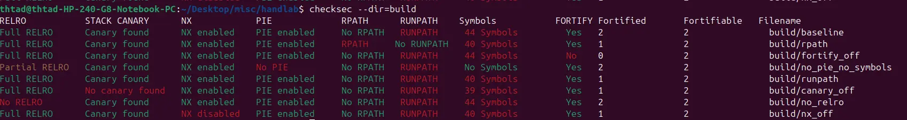
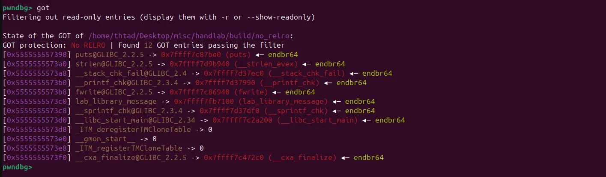
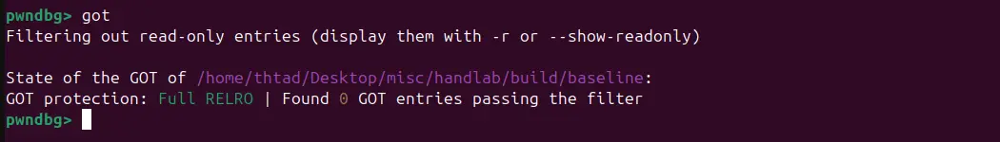
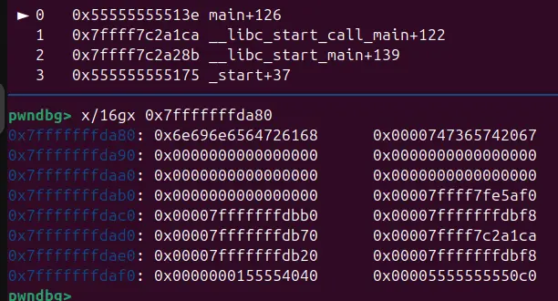
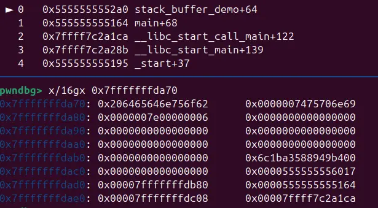
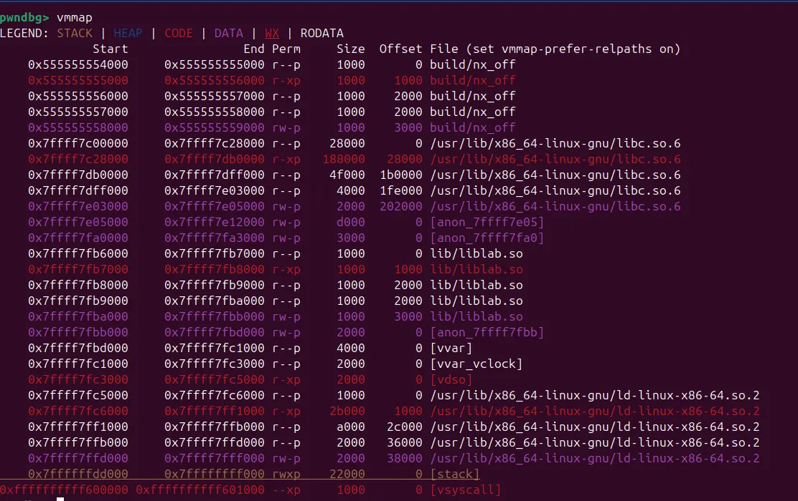
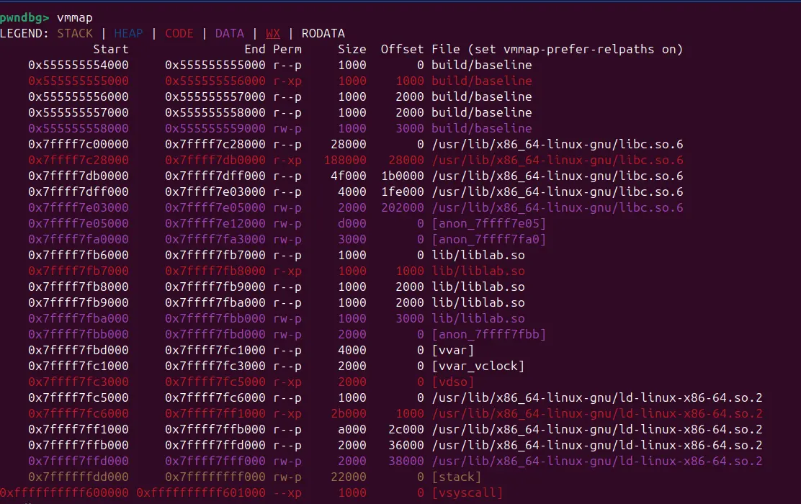

To install:

```
sudo apt install checksec
```

**example:



in these suceeding test, inspections will be carried out between deformed processes and ./baseline

**No RELRO:



RELRO protect rellocation sections (such as got table) by making them un-writable (read only)

With this protection off, some sensitive dispatch point can be overwritten for arbitary execution



RELRO on
 
**Canary_off:



no canary protecting stack, return address is at 0x7fffffffdad8



an example with canary enabled, canary is at 0x7fffffffdab8 while ret addr is at 0x7fffffffdad8

also because of no canary, meaning that each function doesnt have own canary to protect itself, functions in the process collapse onto main as there isnt need for the compiler to seperate the functions ( which is the need for seperate canary in this example )

**NX_off:



NX disable executable stack



stack is not executable in process with nx

```
- **RELRO:** relocation sections receive read-only protection; full RELRO also uses immediate binding.
- **Canary:** stack-protector-related symbols were detected.
- **NX:** the stack is marked non-executable according to ELF metadata.
- **PIE:** the executable is position independent and can benefit from ASLR.
- **RPATH/RUNPATH:** embedded library search paths may create loading risks.
- **FORTIFY:** fortified libc calls or related symbols were detected; coverage depends on build conditions.
- **Symbols:** symbols remain available or have been stripped, affecting analysis and sometimes attack surface.
```