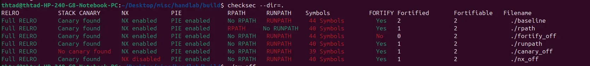

To install:

```
sudo apt install checksec
```

example:




```
- **RELRO:** relocation sections receive read-only protection; full RELRO also uses immediate binding.
- **Canary:** stack-protector-related symbols were detected.
- **NX:** the stack is marked non-executable according to ELF metadata.
- **PIE:** the executable is position independent and can benefit from ASLR.
- **RPATH/RUNPATH:** embedded library search paths may create loading risks.
- **FORTIFY:** fortified libc calls or related symbols were detected; coverage depends on build conditions.
- **Symbols:** symbols remain available or have been stripped, affecting analysis and sometimes attack surface.
```